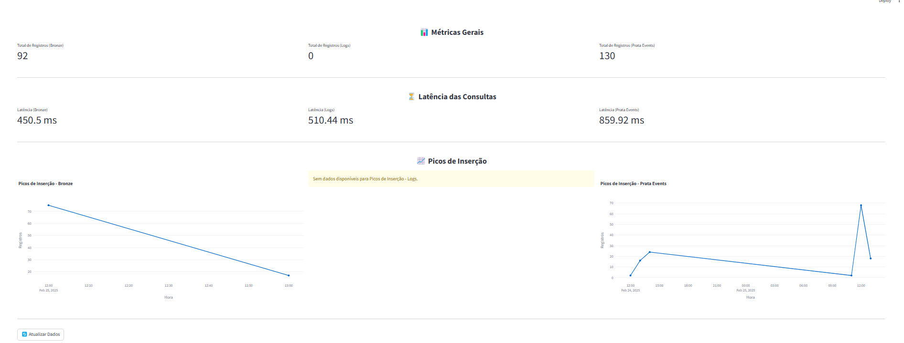

# Dashboard de Telemetria - Supabase & ClickHouse  

## Arquitetura  
- **Data Lake**: Supabase (Tabelas `bronze` e `logs`).  
- **Data Warehouse**: ClickHouse (Tabela `prata_events`).  
- **Dashboard**: Streamlit (Exibição interativa das métricas).  

A estrutura modular permite fácil adição de novas tabelas. Como os dados ainda estão limitados e as tabelas possuem o mesmo volume, foi feita a análise sobre um subconjunto representativo(2 do supabase e 1 do Clickhouse).

---

## Métricas Monitoradas  
- **Total de Registros**: Contagem total de cada tabela.  
- **Picos de Inserção**: Registros agrupados por hora, permitindo identificar padrões e possíveis picos de carga.  
- **Latência das Consultas**: Tempo de resposta do banco para cada métrica.  

---

## Ponto a serem avaliados 

### 1. Compreensão dos Dados
Os dados são analisados por meio da contagem total e da distribuição temporal (`timestamp`/`created_at`). Isso possibilita identificar padrões de inserção e prever variações na carga.  

### 2. Seleção de Métricas Relevantes
As métricas escolhidas monitoram volume de dados, comportamento temporal e tempo de resposta. O foco inicial está em detecção de padrões de inserção e análise de desempenho do banco.  

### 3. Eficiência na Integração de Dados  
Os dados são coletados automaticamente via APIs do Supabase e ClickHouse, garantindo uma integração eficiente e escalável. A modularidade permite adicionar novas tabelas facilmente.  

### 4. Design e Usabilidade do Dashboard 
O dashboard apresenta métricas de forma clara e interativa, permitindo acompanhamento em tempo real e facilitando a interpretação dos dados. 


### 5. Análise e Interpretação dos Resultados
Atualmente, a carga de dados é baixa, o que limita análises aprofundadas. No entanto, a latência das queries indica que o banco está operando dentro dos padrões esperados.  

---

## Execução  

### Instalar Dependências  
```bash
pip install -r requirements.txt
```

### Configurar o .env
```bash
SUPABASE_URL=https://seuprojeto.supabase.co
SUPABASE_API_KEY=sua_chave_api
CLICKHOUSE_HOST=seu_host
CLICKHOUSE_USER=seu_usuario
CLICKHOUSE_PASSWORD=sua_senha

```

### Rodar o dash

```bash
streamlit run app.py
```